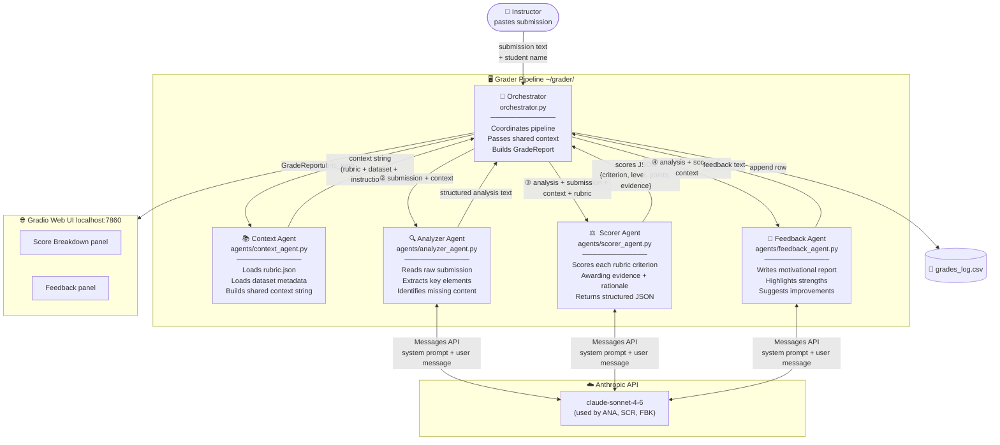

# Assignment 1.4 Multi-Agent Grader

Automated grading system for Indiana Wesleyan University Assignment 1.4 — Fruit Sorting / Classification. Paste a student submission into the web UI and receive a rubric-scored grade breakdown plus motivational feedback in seconds.

---

## Multi-Agent Architecture



---

## Communication Protocols

The system uses a **centralized sequential pipeline** — the Orchestrator is the sole coordinator. No agent talks directly to another; all data flows through the Orchestrator.

### Step-by-step message flow

```
Instructor Input
      │
      ▼
① Orchestrator → Context Agent
      │  Input:  rubric_path (Path object)
      │  Output: context string — a plain-text block containing:
      │            • Assignment instructions and grading notes
      │            • Full rubric (all criteria, levels, point values)
      │            • Dataset reference (5 classes, image specs, visual traits)
      │  Protocol: direct Python function call (no LLM)
      │
      ▼
② Orchestrator → Analyzer Agent
      │  Input:  (anthropic.Client, submission_text: str, context: str)
      │  Output: structured analysis text with labeled sections:
      │            DATASET_UNDERSTANDING / METHOD_CHOSEN / METHOD_STEPS /
      │            DECISION_POINTS / METHOD_JUSTIFICATION / MISSING_ELEMENTS
      │  Protocol: Anthropic Messages API
      │            • System prompt: role + full context string
      │            • User message:  raw submission + extraction instructions
      │            • Model: claude-sonnet-4-6 | max_tokens: 1024
      │
      ▼
③ Orchestrator → Scorer Agent
      │  Input:  (client, analysis: str, submission_text: str,
      │           context: str, rubric: dict)
      │  Output: JSON object —
      │            { scores: [{criterion_id, criterion_name, level_awarded,
      │                        points_awarded, max_points, evidence, rationale}],
      │              total_points: int, total_possible: int }
      │  Protocol: Anthropic Messages API
      │            • System prompt: grader role + full context string
      │            • User message:  analysis + original submission +
      │                             rubric JSON + scoring rules
      │            • Model: claude-sonnet-4-6 | max_tokens: 2048
      │            • Response parsed with json.loads()
      │
      ▼
④ Orchestrator → Feedback Agent
      │  Input:  (client, submission_text: str, analysis: str,
      │           scores: dict, context: str)
      │  Output: motivational feedback text (≤400 words) containing:
      │            • Opening acknowledgement
      │            • 2-3 specific strengths with evidence
      │            • 2-3 actionable improvement suggestions
      │            • Final grade statement
      │            • Closing motivational sentence
      │  Protocol: Anthropic Messages API
      │            • System prompt: instructor persona + full context string
      │            • User message:  score breakdown + analysis + instructions
      │            • Model: claude-sonnet-4-6 | max_tokens: 1024
      │
      ▼
GradeReport (dataclass)
      ├── .summary()        → formatted text for terminal
      ├── .feedback         → motivational response
      ├── .scores           → full JSON score breakdown
      ├── .total_points     → e.g. 34
      ├── .total_possible   → 40
      └── .percentage       → e.g. 85.0
```

### Shared context protocol

Every LLM agent receives the **same context string** in its system prompt, built once by the Context Agent. This ensures all agents reason against an identical ground truth — the same rubric definitions, dataset facts, and assignment instructions — without duplicating logic or risking drift between agents.

```
context string structure
────────────────────────
=== ASSIGNMENT CONTEXT ===
  Assignment instructions + critical grading notes

=== DATASET REFERENCE ===
  5 classes | 10,000 images | 225×225 RGB JPEG
  Per-class visual traits (color, shape, texture)

=== GRADING RUBRIC ===
  5 criteria × 4 levels (excellent/competent/needs_improvement/inadequate)
  Point values and full level descriptions
```

### Data types in transit

| Leg | Carrier | Format |
|-----|---------|--------|
| Orchestrator → Context Agent | Python call | `Path` → `str` |
| Orchestrator → Analyzer Agent | Anthropic API | `str` → `str` |
| Orchestrator → Scorer Agent | Anthropic API | `str` + `dict` → `dict` (JSON) |
| Orchestrator → Feedback Agent | Anthropic API | `str` + `dict` → `str` |
| Orchestrator → UI | Python object | `GradeReport` dataclass |
| Orchestrator → Disk | CSV append | `GradeReport.to_dict()` |

---

## Rubric (Assignment 1.4 — 40 points)

| Criterion | Max | Excellent | Competent | Needs Improvement | Inadequate |
|-----------|-----|-----------|-----------|-------------------|------------|
| Method Selection & Justification | 10 | 10 | 9 | 8 | 6 |
| Implementation Process | 10 | 10 | 9 | 8 | 6 |
| Results and Outcomes | 10 | 10 | 9 | 8 | 6 |
| Instructions Quality | 6 | 6 | 5 | 4 | 3 |
| Documentation & Presentation | 4 | 4 | 3 | 2 | 1 |

> **Note:** This is a theoretical assignment — students describe what *would* happen, not actual code output. The grader accounts for this when evaluating Results and Outcomes.

---

## Dataset Reference

**Fruits Classification** — [Kaggle](https://www.kaggle.com/datasets/utkarshsaxenadn/fruits-classification)

| Property | Value |
|----------|-------|
| Classes | Apple, Banana, Grape, Mango, Strawberry |
| Total images | 10,000 (2,000 per class, balanced) |
| Split | 97% train / 2% valid / 1% test |
| Image size | 225 × 225 pixels, RGB JPEG |
| Structure | `train/<class>/`, `valid/<class>/`, `test/<class>/` |

---

## Setup

```bash
# 1. Clone
git clone https://github.com/johnnyCRF450/grader.git
cd grader

# 2. Install dependencies
pip install anthropic gradio kagglehub pandas pillow

# 3. Set API key
echo 'export ANTHROPIC_API_KEY="sk-ant-..."' >> ~/.zshrc
source ~/.zshrc

# 4. Launch
python app.py
# → opens at http://localhost:7860
```

---

## Usage

1. Log into Brightspace and open the student's submission
2. Copy the full submission text
3. Open `http://localhost:7860`
4. Enter the student's name and paste their submission
5. Click **Grade Submission**
6. Copy the score breakdown and feedback into Brightspace

Grades are automatically appended to `grades_log.csv` (excluded from git).

---

## File Structure

```
grader/
├── agents/
│   ├── analyzer_agent.py   # extracts key elements from submission
│   ├── context_agent.py    # builds shared context (rubric + dataset)
│   ├── feedback_agent.py   # generates motivational grade report
│   └── scorer_agent.py     # scores each rubric criterion → JSON
├── app.py                  # Gradio web UI
├── dataset_context.py      # fruits dataset knowledge base (DataFrame)
├── orchestrator.py         # coordinates 4-agent pipeline
├── rubric.json             # Assignment 1.4 grading rubric
└── grades_log.csv          # auto-generated grade log (gitignored)
```
